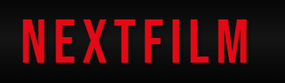
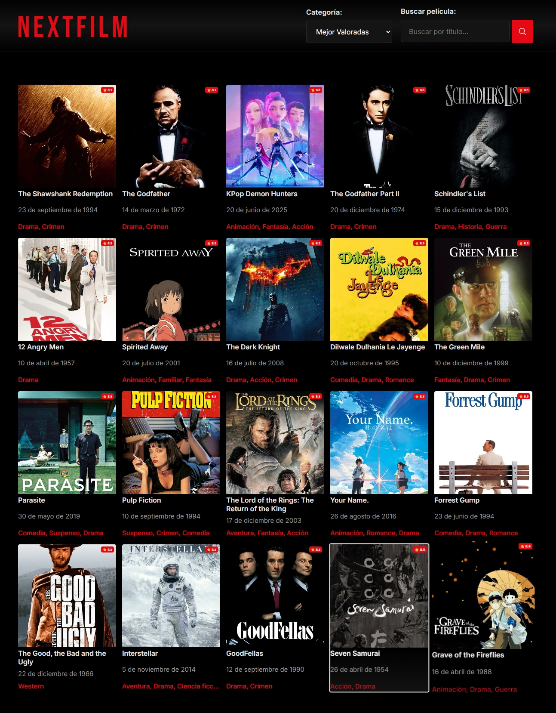
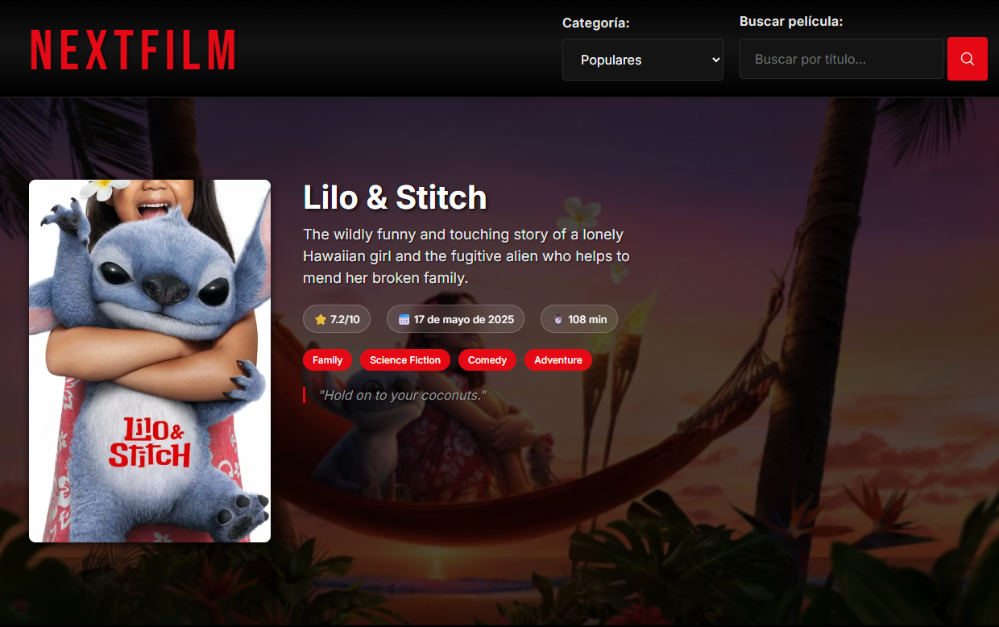
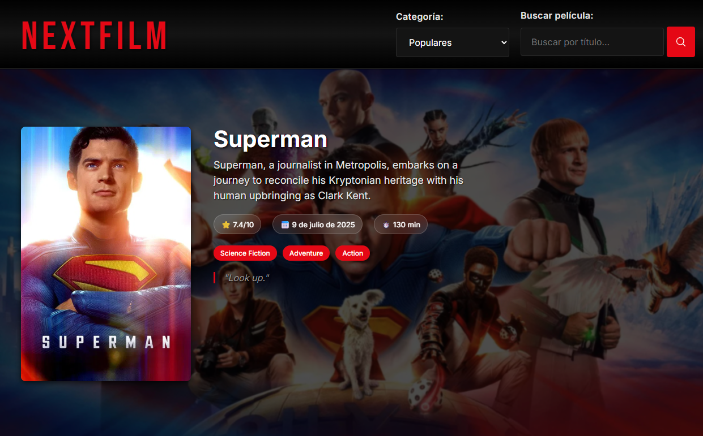
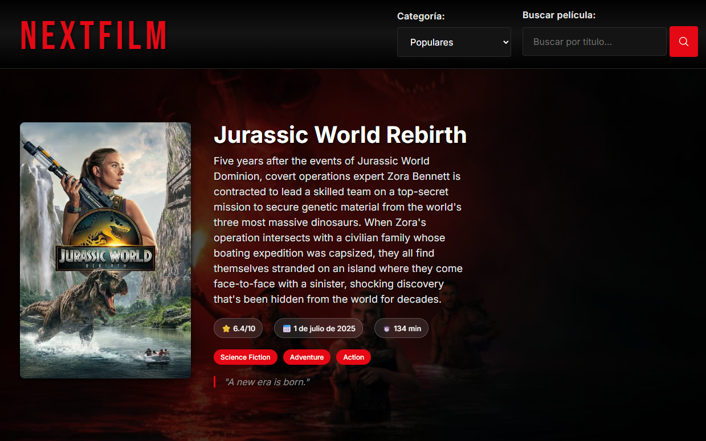
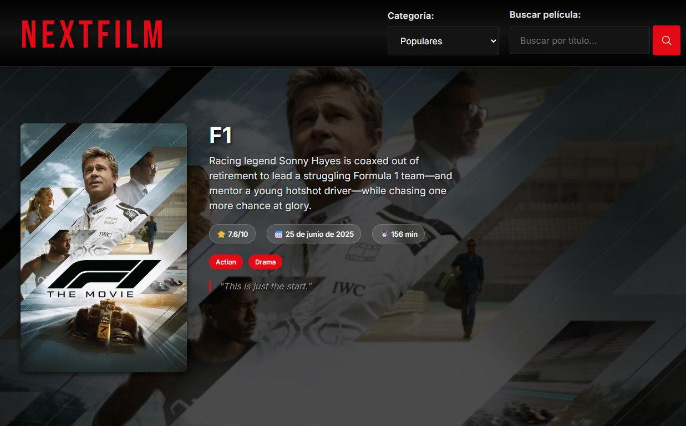
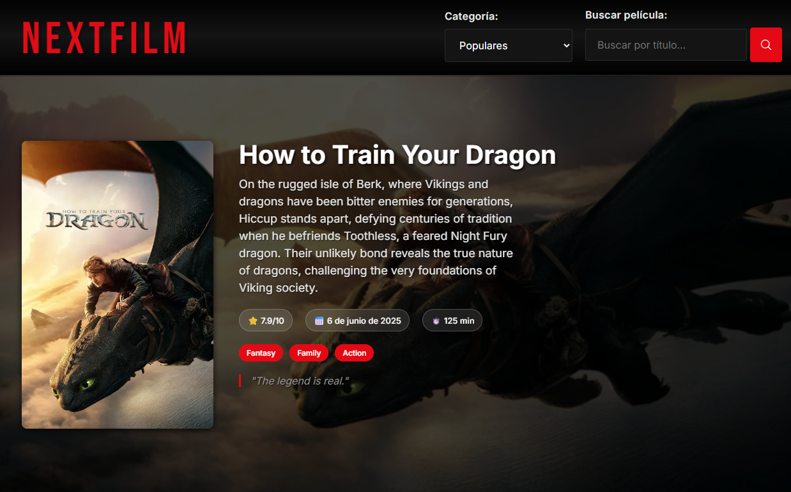
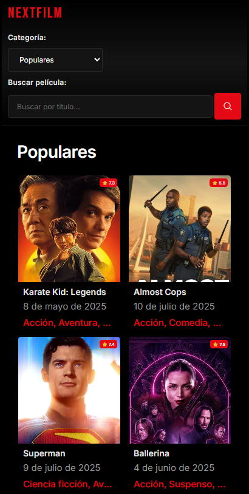

<div align="center">



# NEXTFILM
[](https://reactjs.org/)
[](https://www.typescriptlang.org/)
[](https://vitejs.dev/)
[](https://www.themoviedb.org/)

> React, Netflix-inspired movie discovery web application built with React, TypeScript, and Vite. Features real-time movie data from The Movie Database (TMDb) API with a stunning responsive design.

# [🚀 Live Demo](https://nextfilm2.netlify.app/) 
</div>

## 📸 Screenshots
---
<p align="center">






  
</p>
## ✨ Features

### � Core Functionality
- **🔍 Advanced Search**: Real-time movie search with smart filtering
- **📱 Responsive Design**: Netflix-style interface optimized for all devices
- **🎭 Category Browsing**: Popular, Top Rated, Upcoming, and Now Playing movies
- **🎥 Movie Details**: Comprehensive information including ratings, genres, and release dates
- **🎬 Video Integration**: YouTube trailers and promotional videos
- **⚡ Real-time Updates**: Dynamic content loading with smooth transitions

### 🎨 Design & UX
- **Netflix-inspired UI**: Dark theme with red accent colors
- **Bebas Neue Typography**: Professional branding with Google Fonts
- **Smooth Animations**: Hover effects and transitions
- **Modern Icons**: SVG-based iconography
- **Mobile-first Approach**: Optimized for touch interactions

### 🛠 Technical Features
- **Type-safe Development**: Full TypeScript implementation
- **State Management**: Efficient global state with Zustand
- **API Integration**: Robust HTTP client with Axios
- **Schema Validation**: Runtime type checking with Zod
- **Performance Optimized**: Fast loading with Vite bundler
- **Code Quality**: ESLint integration for consistent code standards

## 🚀 Tech Stack

### Frontend
- **React 18.2.0** - Modern UI library with hooks and concurrent features
- **TypeScript 5.0.2** - Type-safe JavaScript for better development experience
- **Vite 7.0.4** - Next-generation frontend tooling for fast development
- **CSS3** - Custom styling with CSS Grid, Flexbox, and animations

### State Management & Data
- **Zustand 4.4.3** - Lightweight state management solution
- **Axios 1.5.1** - Promise-based HTTP client for API requests
- **Zod 3.22.4** - TypeScript-first schema validation

### API & Services

<div align="center">
  <a href="https://www.themoviedb.org/" target="_blank" rel="noopener noreferrer">
    
  </a>
</div>

- **The Movie Database (TMDb) API v3** - Comprehensive movie database
- **YouTube API** - Video content integration

### Development Tools
- **React Router DOM 7.6.3** - Declarative routing for React
- **ESLint** - Code linting and quality assurance
- **Autoprefixer** - CSS vendor prefixing
- **PostCSS** - CSS processing tool

## 📁 Project Structure

```
NEXTFILM/
├── public/
│   ├── images/           # Static assets and screenshots
│   └── favico.svg       # Favicon
├── src/
│   ├── components/      # Reusable React components
│   │   ├── MovieSearchForm.tsx
│   │   ├── CryptoPriceDisplay.tsx
│   │   ├── MovieTrailers.tsx
│   │   ├── ErrorMessage.tsx
│   │   ├── Footer.tsx
│   │   └── Spinner.tsx
│   ├── pages/           # Page components
│   │   ├── Home.tsx
│   │   └── Credits.tsx
│   ├── services/        # API integration
│   │   └── MovieService.ts
│   ├── types/           # TypeScript type definitions
│   │   └── index.ts
│   ├── schema/          # Zod validation schemas
│   │   └── crypto-schema.ts
│   ├── data/            # Static data and configurations
│   │   └── index.ts
│   ├── App.tsx          # Main application component
│   ├── main.tsx         # Application entry point
│   ├── store.ts         # Zustand store configuration
│   ├── index.css        # Global styles and Netflix theme
│   └── vite-env.d.ts    # Vite type definitions
├── tsconfig.json        # TypeScript configuration
├── vite.config.ts       # Vite configuration
└── package.json         # Project dependencies and scripts
```

## 🎯 Getting Started

### Prerequisites
- **Node.js** (v16 or higher)
- **npm** or **yarn**
- **TMDb API Key** (free registration)

### Installation

1. **Clone the repository**
   ```bash
   git clone https://github.com/firedevelop/NEXTFILM.git
   cd NEXTFILM
   ```

2. **Install dependencies**
   ```bash
   npm install
   ```

3. **Environment Setup**
   - The application includes pre-configured TMDb API credentials
   - For production use, configure your own API keys in the service files

4. **Start development server**
   ```bash
   npm run dev
   ```
   
   Open [http://localhost:5173](http://localhost:5173) in your browser

5. **Build for production**
   ```bash
   npm run build
   npm run preview
   ```

## 📱 Usage Guide

### Navigation
- **🏠 Home Logo**: Click NEXTFILM logo to refresh and return to popular movies
- **📂 Categories**: Use dropdown to switch between movie categories
- **🔍 Search**: Type in search box and click search icon to find specific movies
- **🎬 Movie Selection**: Click any movie card to view detailed information

### Available Categories
- **🔥 Popular**: Currently trending movies worldwide
- **⭐ Top Rated**: Highest-rated movies by user reviews
- **🆕 Upcoming**: Movies releasing soon
- **� Now Playing**: Currently in theaters

### Features
- **📺 Video Trailers**: Watch YouTube trailers directly in the app
- **📊 Movie Ratings**: View IMDb-style ratings and vote counts
- **🎭 Genre Tags**: Quick genre identification with color-coded tags
- **📅 Release Information**: Detailed release dates and status

## 🎨 Design System

### Color Palette
```css
--netflix-black: #000000      /* Primary background */
--netflix-dark: #141414       /* Secondary background */
--netflix-red: #e50914        /* Brand color */
--netflix-white: #ffffff      /* Primary text */
--netflix-text-gray: #999999  /* Secondary text */
```

### Typography
- **Primary Font**: Inter (clean, modern sans-serif)
- **Brand Font**: Bebas Neue (bold, cinematic feel for logo)
- **Responsive Scaling**: rem-based sizing with 62.5% base

### Layout Principles
- **Mobile-first**: Responsive design starting from 320px
- **Netflix Grid**: Auto-fitting movie cards with consistent aspect ratios
- **Smooth Transitions**: 0.3s ease transitions for interactive elements

## 📊 Performance Optimizations

- **⚡ Vite HMR**: Hot module replacement for instant development feedback
- **🔧 Code Splitting**: Automatic route-based code splitting
- **📦 Tree Shaking**: Unused code elimination in production builds
- **🖼️ Image Optimization**: Responsive images with proper sizing
- **� State Persistence**: Efficient state management with Zustand

## 🧪 Development Scripts

```bash
npm run dev       # Start development server with HMR
npm run build     # Type-check and build for production
npm run preview   # Preview production build locally
npm run lint      # Run ESLint for code quality checks
```

## 🔧 Configuration Files

- **`tsconfig.json`**: TypeScript compiler configuration
- **`vite.config.ts`**: Vite bundler settings and plugins
- **`package.json`**: Dependencies and project metadata

## 🚀 Deployment

### Build Process
```bash
# 1. Type checking
tsc --noEmit

# 2. Production build
npm run build

# 3. Generated files in dist/
# Ready for deployment to any static hosting service
```

### Recommended Hosting
- **Vercel** - Optimal for React applications
- **Netlify** - Easy deployment with CI/CD
- **GitHub Pages** - Free hosting for public repositories

## 🤝 Contributing

Contributions are welcome! Please follow these steps:

1. **Fork** the repository
2. **Create** a feature branch (`git checkout -b feature/amazing-feature`)
3. **Commit** your changes (`git commit -m 'Add amazing feature'`)
4. **Push** to the branch (`git push origin feature/amazing-feature`)
5. **Open** a Pull Request

### Development Guidelines
- Follow TypeScript best practices
- Maintain responsive design principles
- Write meaningful commit messages
- Test on multiple devices and browsers

## 📄 License

This project is licensed under the **MIT License** - see the [LICENSE](LICENSE) file for details.

## 🙏 Acknowledgments

<div align="center">
  <a href="https://www.themoviedb.org/" target="_blank" rel="noopener noreferrer">
    
  </a>
</div>

- **[The Movie Database (TMDb)](https://www.themoviedb.org/)** - Comprehensive movie data API
- **[Netflix](https://netflix.com)** - Design inspiration
- **[React Community](https://react.dev/)** - Amazing framework and ecosystem
- **[Google Fonts](https://fonts.google.com/)** - Typography resources

## 📞 Contact

**Developer**: [firedevelop](https://github.com/firedevelop)

---

<div align="center">

**🎬 Built with passion for cinema and modern web development**

*This project demonstrates proficiency in React, TypeScript, API integration, responsive design, and modern frontend development practices.*

</div>
